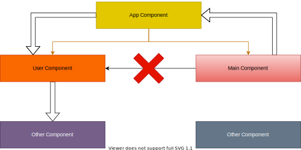
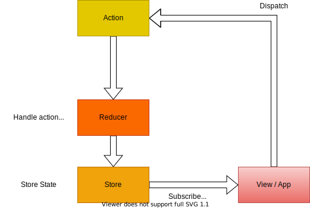
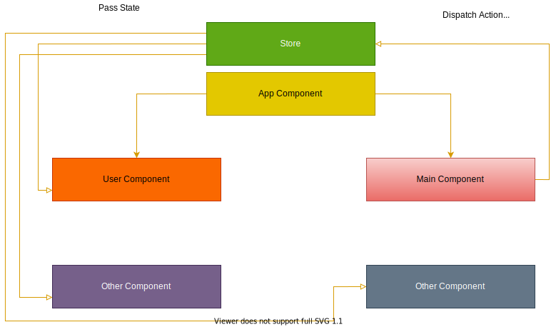

# Redux

Redux is the solution to handle the data in different states in Our App.

Redux is a predictable state container designed to help you write JavaScript apps that behave consistently across client, server, and native environments and are easy to test.

## Problem in React state mangement approach

- If we are dealing with multiple component the to change the state we have to go through main component and all other component which will hiegher than the desired component.

## How Redux Works ?

In redux we have view and view dispatch actions .

This action then go through reducer, the reducer has to lookup to the action and perform operation based on action. reducer has functions to handle different types of actions. And than take the old state and manipulate it in a way that it now reflects this action so tke the old state adds or execute this single action on the old state and give us back a new state.

It is best to perform these actions in an immutable way which means don't change old state instead take it as a basis and then create a brand new state like copy of old state with chnaged values.

Store will atomatically send the change to all the component interested in that change.

### It will look like this

